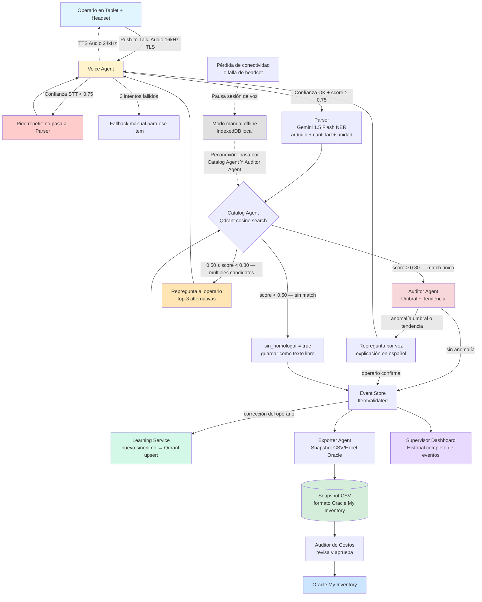
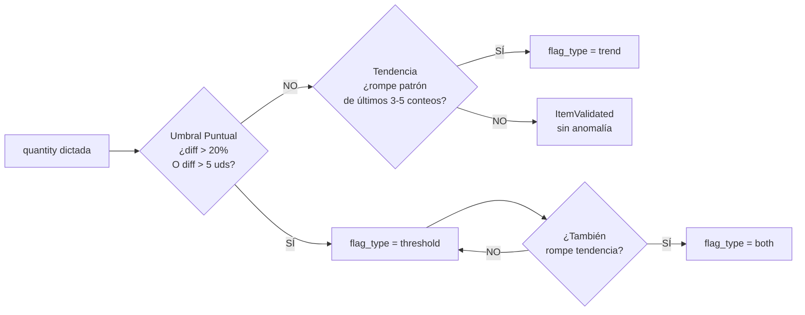
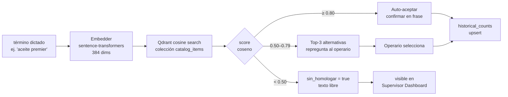
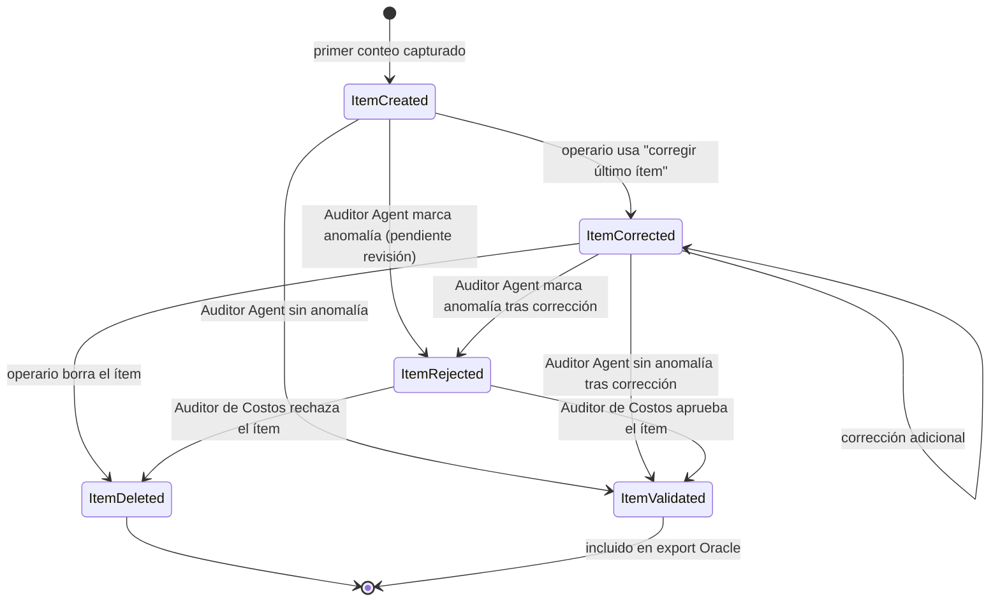

# Data Flow Diagram

Adaptado del spec.md §17. Muestra todos los paths incluyendo casos de error, modo offline y retroalimentación al catálogo.

---

## Detalle: Detección de Anomalías (Auditor Agent)

---

## Detalle: Homologación Semántica (Catalog Agent)

---

## Modelo de Eventos por Ítem

