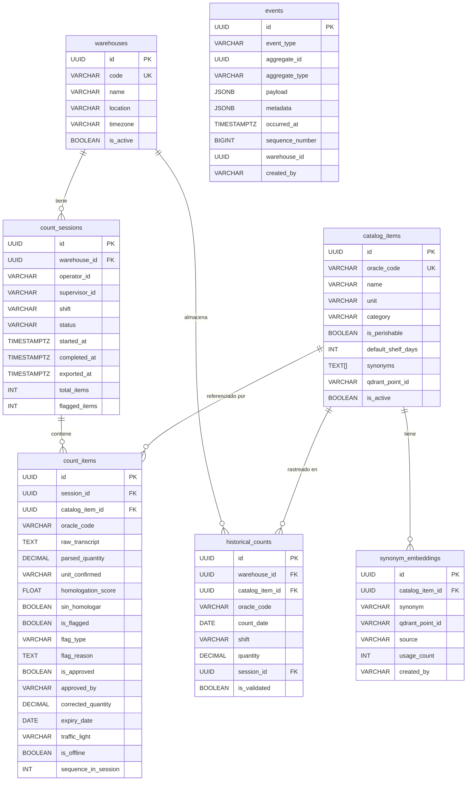

# Database Schema — 7 Tablas

## ERD



---

## Definiciones SQL

### `events` (append-only — núcleo del event sourcing)
```sql
CREATE TABLE events (
    id              UUID PRIMARY KEY DEFAULT gen_random_uuid(),
    event_type      VARCHAR(50)  NOT NULL,
    -- ItemCreated | ItemCorrected | ItemDeleted | ItemValidated | ItemRejected
    aggregate_id    UUID         NOT NULL,
    aggregate_type  VARCHAR(50)  NOT NULL,   -- CountSession | CountItem
    payload         JSONB        NOT NULL,
    metadata        JSONB        NOT NULL DEFAULT '{}',
    -- metadata: {user_id, warehouse_id, device_id, correlation_id, is_offline}
    occurred_at     TIMESTAMPTZ  NOT NULL DEFAULT NOW(),
    sequence_number BIGINT       GENERATED ALWAYS AS IDENTITY,
    warehouse_id    UUID         NOT NULL,
    created_by      VARCHAR(100) NOT NULL
);
-- NUNCA hacer UPDATE ni DELETE sobre esta tabla
CREATE INDEX idx_events_aggregate ON events(aggregate_id, sequence_number);
CREATE INDEX idx_events_type_time  ON events(event_type, occurred_at DESC);
CREATE INDEX idx_events_warehouse  ON events(warehouse_id, occurred_at DESC);
```

### `warehouses`
```sql
CREATE TABLE warehouses (
    id        UUID         PRIMARY KEY DEFAULT gen_random_uuid(),
    code      VARCHAR(64)  UNIQUE NOT NULL,   -- "PSL-ALMACEN-GENERAL" (ver data/warehouses.csv — algunos nombres reales superan 20 chars)
    name      VARCHAR(200) NOT NULL,
    location  VARCHAR(200),
    timezone  VARCHAR(50)  DEFAULT 'America/Bogota',
    is_active BOOLEAN      DEFAULT TRUE,
    created_at TIMESTAMPTZ DEFAULT NOW(),
    updated_at TIMESTAMPTZ DEFAULT NOW()
);
```

### `catalog_items`
```sql
CREATE TABLE catalog_items (
    id                UUID         PRIMARY KEY DEFAULT gen_random_uuid(),
    oracle_code       VARCHAR(50)  UNIQUE NOT NULL,
    name              VARCHAR(300) NOT NULL,
    unit              VARCHAR(30)  NOT NULL,
    category          VARCHAR(100),
    subcategory       VARCHAR(100),
    is_perishable     BOOLEAN      DEFAULT FALSE,
    default_shelf_days INT,
    synonyms          TEXT[]       DEFAULT '{}',
    qdrant_point_id   VARCHAR(100),
    is_active         BOOLEAN      DEFAULT TRUE,
    last_synced_at    TIMESTAMPTZ,
    created_at        TIMESTAMPTZ  DEFAULT NOW(),
    updated_at        TIMESTAMPTZ  DEFAULT NOW()
);
CREATE INDEX idx_catalog_ft     ON catalog_items USING gin(to_tsvector('spanish', name));
CREATE INDEX idx_catalog_active ON catalog_items(is_active, category);
```

### `count_sessions`
```sql
CREATE TABLE count_sessions (
    id           UUID         PRIMARY KEY DEFAULT gen_random_uuid(),
    warehouse_id UUID         NOT NULL REFERENCES warehouses(id),
    operator_id  VARCHAR(100) NOT NULL,
    supervisor_id VARCHAR(100),
    shift        VARCHAR(20)  NOT NULL,   -- morning | afternoon | night
    status       VARCHAR(30)  NOT NULL DEFAULT 'in_progress',
    -- in_progress → pending_review → approved → exported | cancelled
    started_at   TIMESTAMPTZ  DEFAULT NOW(),
    completed_at TIMESTAMPTZ,
    exported_at  TIMESTAMPTZ,
    export_path  TEXT,
    total_items  INTEGER      DEFAULT 0,
    flagged_items INTEGER     DEFAULT 0,
    created_at   TIMESTAMPTZ  DEFAULT NOW(),
    updated_at   TIMESTAMPTZ  DEFAULT NOW()
);
CREATE INDEX idx_sessions_warehouse ON count_sessions(warehouse_id, started_at DESC);
CREATE INDEX idx_sessions_status    ON count_sessions(status, started_at DESC);
```

### `count_items`
```sql
CREATE TABLE count_items (
    id                  UUID         PRIMARY KEY DEFAULT gen_random_uuid(),
    session_id          UUID         NOT NULL REFERENCES count_sessions(id),
    catalog_item_id     UUID         REFERENCES catalog_items(id),
    oracle_code         VARCHAR(50),
    raw_transcript      TEXT,
    parsed_article      VARCHAR(300),
    parsed_quantity     DECIMAL(15,4) NOT NULL,
    parsed_unit         VARCHAR(30),
    homologated_name    VARCHAR(300),
    homologation_score  FLOAT,
    sin_homologar       BOOLEAN      DEFAULT FALSE,
    quantity_confirmed  DECIMAL(15,4),
    unit_confirmed      VARCHAR(30),
    is_flagged          BOOLEAN      DEFAULT FALSE,
    flag_type           VARCHAR(50),    -- threshold | trend | both
    flag_reason         TEXT,
    is_approved         BOOLEAN,        -- NULL = pendiente
    approved_by         VARCHAR(100),
    approved_at         TIMESTAMPTZ,
    rejection_reason    TEXT,
    corrected_quantity  DECIMAL(15,4),
    expiry_date         DATE,
    traffic_light       VARCHAR(10),    -- red | yellow | green
    is_offline          BOOLEAN      DEFAULT FALSE,
    sequence_in_session INTEGER,
    created_at          TIMESTAMPTZ  DEFAULT NOW(),
    updated_at          TIMESTAMPTZ  DEFAULT NOW()
);
CREATE INDEX idx_items_session ON count_items(session_id, sequence_in_session);
CREATE INDEX idx_items_flagged ON count_items(is_flagged, is_approved)
    WHERE is_flagged = TRUE;
CREATE INDEX idx_items_catalog ON count_items(catalog_item_id, created_at DESC);
```

### `historical_counts` (read model — reconstruido desde eventos)
```sql
CREATE TABLE historical_counts (
    id              UUID         PRIMARY KEY DEFAULT gen_random_uuid(),
    warehouse_id    UUID         NOT NULL REFERENCES warehouses(id),
    catalog_item_id UUID         NOT NULL REFERENCES catalog_items(id),
    oracle_code     VARCHAR(50)  NOT NULL,
    count_date      DATE         NOT NULL,
    shift           VARCHAR(20),
    quantity        DECIMAL(15,4) NOT NULL,
    session_id      UUID         REFERENCES count_sessions(id),
    is_validated    BOOLEAN      DEFAULT FALSE,
    created_at      TIMESTAMPTZ  DEFAULT NOW()
);
CREATE UNIQUE INDEX idx_hist_unique ON historical_counts
    (warehouse_id, catalog_item_id, count_date, shift);
CREATE INDEX idx_hist_lookup ON historical_counts
    (warehouse_id, catalog_item_id, count_date DESC);
```

### `synonym_embeddings` (aprendizaje continuo)
```sql
CREATE TABLE synonym_embeddings (
    id              UUID         PRIMARY KEY DEFAULT gen_random_uuid(),
    catalog_item_id UUID         NOT NULL REFERENCES catalog_items(id),
    synonym         VARCHAR(300) NOT NULL,
    qdrant_point_id VARCHAR(100),
    source          VARCHAR(50)  DEFAULT 'operator_correction',
    confidence      FLOAT        DEFAULT 1.0,
    usage_count     INTEGER      DEFAULT 0,
    created_by      VARCHAR(100),
    created_at      TIMESTAMPTZ  DEFAULT NOW(),
    UNIQUE(catalog_item_id, synonym)
);
```

---

## Qdrant Collection Schema

```yaml
collection_name: catalog_items
vectors:
  size: 384          # paraphrase-multilingual-MiniLM-L12-v2
  distance: Cosine
hnsw_config:
  m: 16
  ef_construct: 100
payload_schema:
  oracle_code: keyword
  name: text
  category: keyword
  unit: keyword
  is_perishable: bool
  source: keyword    # canonical | synonym
```

- Cada artículo del catálogo tiene **un punto canónico** en Qdrant.
- Cada sinónimo aprendido tiene su **propio punto separado** (mismo `oracle_code` en payload) para poder rastrear y eliminar sinónimos individuales si son erróneos.
