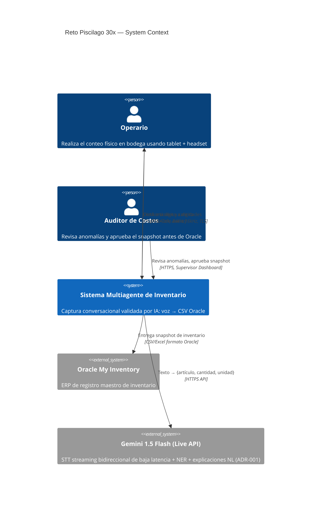
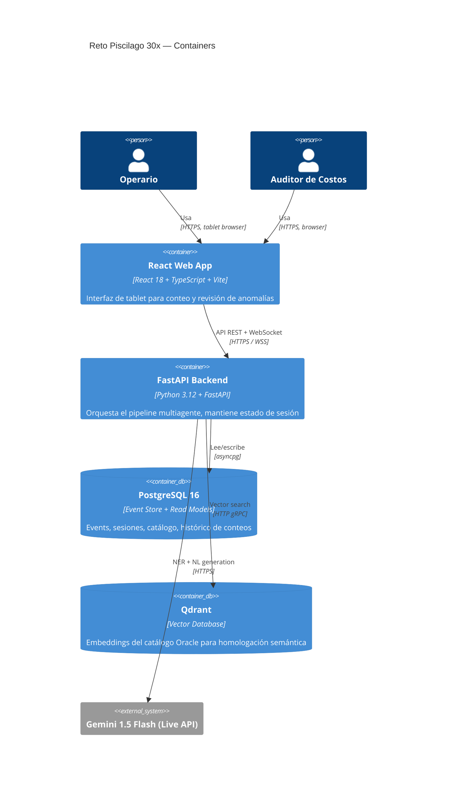
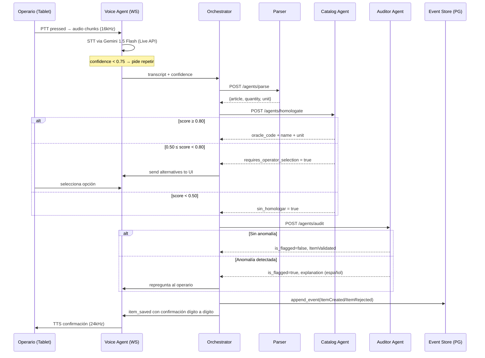

# Architecture Overview — Sistema Multiagente de Inventario

## C4 Level 1 — Context Diagram

---

## C4 Level 2 — Container Diagram

---

## Pipeline de Agentes — Detalle del Hot Path

---

## Stack Tecnológico

| Capa | Tecnología | Versión |
|---|---|---|
| Backend | FastAPI | 0.111+ |
| ORM | SQLAlchemy (async) | 2.0+ |
| Migraciones | Alembic | 1.13+ |
| Vector DB | Qdrant | 1.9+ |
| Embeddings | sentence-transformers `paraphrase-multilingual-MiniLM-L12-v2` | local |
| STT | Gemini Live API (WebSocket, ADR-001) | gemini-1.5-flash |
| LLM | Gemini 1.5 Flash (NER + explicaciones NL, ADR-001) | gemini-1.5-flash |
| Frontend | React 18 + TypeScript + Vite | React 18.3 |
| Estado (client) | Zustand | 4+ |
| Offline storage | Dexie.js (IndexedDB) | 3+ |
| Orquestación local | Docker Compose | v2 |
