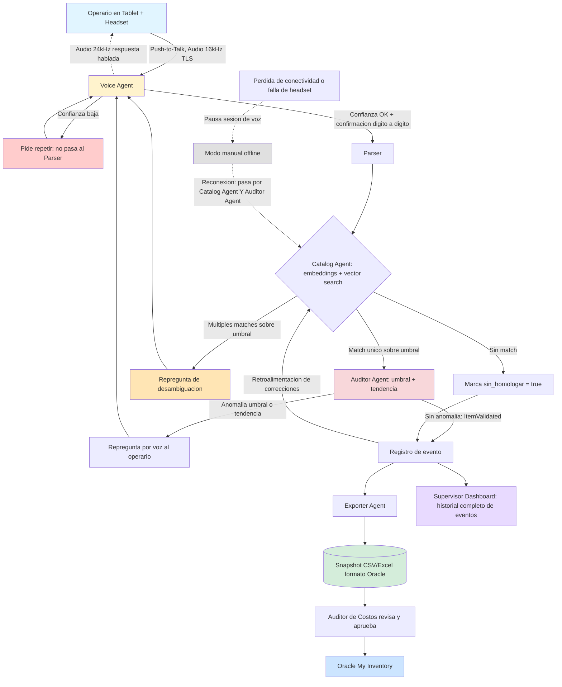

# SPEC.MD — Sistema Multiagente de Reducción de Pérdidas de Inventario
### Reto 04 · Piscilago (Recreación y Piscinas) · Colsubsidio Innovación

> **Metodología:** Spec Kit — determinismo sobre generación creativa. Este documento es la fuente de verdad del sistema. **v4:** se reposiciona la narrativa de negocio (el problema es la pérdida de inventario, no la voz), se explicita la arquitectura multiagente, se sube de nivel la homologación con embeddings, se agrega trazabilidad de razonamiento, modelo de eventos, aprendizaje continuo, KPIs y visión de negocio. **v5:** se corrige el dominio de negocio — el operador real no es un hotel sino **Piscilago**, el parque de recreación y piscinas de Colsubsidio, con bodegas de suministros que abarcan alimentos y bebidas, insumos de enfermería, papelería, ferretería, dotación y zoológico. El catálogo de "más de 107 artículos por bodega" era un supuesto inicial; el catálogo maestro real, importado de datos operativos (`data/catalog.csv`), tiene **1041 artículos únicos** repartidos en 48 bodegas.

---

## 0. EL PROBLEMA DE NEGOCIO (por qué existe esto)

> **El mayor costo del inventario no está en contar productos, sino en los errores humanos de digitación, las demoras entre el conteo y el registro, y las discrepancias que se detectan demasiado tarde para actuar sobre ellas.**

48 bodegas de Piscilago (parque de recreación y piscinas de Colsubsidio) con un catálogo maestro real de 1041 artículos únicos — desde alimentos y bebidas hasta insumos de enfermería, papelería, ferretería, dotación y suministros de zoológico —, y un proceso de "papel → digitación → revisión" que toma días y donde un "9" se convierte en "90" sin que nadie lo note hasta que el inventario ya no cuadra. La voz es el mecanismo de captura elegido — pero el objetivo del sistema no es "que se pueda hablar", es cerrar la brecha entre lo que realmente hay en la bodega y lo que el sistema cree que hay, en el menor tiempo posible y con la menor pérdida de trazabilidad.

### 0.1 Contexto: proceso de recepción de mercancía (previo al conteo, fuera del alcance operativo del sistema)

> Levantamiento con el negocio (almacenista/auxiliar de almacén). Se documenta aquí como trasfondo — refuerza el diagnóstico de la sección 0 (proceso en papel, propenso a error) — pero el sistema descrito en este spec **arranca en el conteo** (sección 5, paso 1), no en la recepción. Ver también sección 2, límite explícito.

- **Cómo llega el pedido:** el proveedor entrega en el **almacén principal** del Hotel/Club/Parque, cumpliendo las condiciones propias de distribución de alimentos, acompañado de **remisión o factura**. Cada bodega/tienda hace su propio pedido al almacén principal según su necesidad, registrado en el sistema de inventarios — no hay entrega directa del proveedor a cada bodega.
- **Quién recibe:** el almacenista o auxiliar de almacén — no siempre es la misma persona.
- **Cómo se sabe que un pedido debía llegar:** existen tiempos definidos para generar el pedido y para la entrega de cada proveedor. **Sí existe orden de compra** (la genera el área de Compras) y **sí existe una solicitud previa** (el pedido), generada por el almacenista/auxiliar de almacén.
- **Documento de llegada:** remisión o factura únicamente — **no** orden de despacho, **no** guía de transporte (no identifica cantidades/productos).
- **Soporte:** **físico únicamente**, no digital.
- **Contenido típico del documento:** NIT del proveedor, NIT de Colsubsidio, nombre del producto, cantidad, unidad de medida, dirección, fecha, proveedor, número de remisión/orden de compra.

---

## 1. QUÉ HACE (Frase de Apuesta)

> **Un negocio con 48 bodegas necesita eliminar la pérdida de inventario causada por errores de transcripción manual, reemplazando el conteo en papel por una captura conversacional validada por múltiples agentes de IA en tiempo real.**

El operario cuenta en voz alta; un sistema multiagente transcribe, homologa contra el catálogo, detecta anomalías comparando contra el comportamiento histórico de esa bodega, y entrega un archivo listo para Oracle My Inventory — con trazabilidad completa de cada decisión que tomó en el camino.

---

## 2. QUÉ NO HACE (Límites del Sistema)

- **No reemplaza el ERP.** Oracle My Inventory sigue siendo el sistema de registro maestro; esta solución es la capa de captura y validación previa.
- **No hace integración transaccional en vivo con el ERP en esta fase.** El entregable es un snapshot final (CSV/Excel homologado), no un webhook de escritura directa a Oracle.
- **No gestiona compras a proveedores externos ni pasarelas de pago.**
- **No captura ni valida la recepción de mercancía** (remisión/factura física del proveedor en el almacén principal — sección 0.1). El sistema arranca en el conteo de bodega, no en la recepción.
- **No gestiona pedidos de cocina, recetas ni menús.**
- **No corrige stock teórico.** El sistema registra lo que el operario cuenta y señala discrepancias; no las "arregla" por su cuenta.
- **No opera en teléfonos personales.** Es exclusivo para tabletas empresariales por política de seguridad de datos.
- **No corrige errores sistemáticos ya arraigados en el histórico** (ver sección 8.4) — mitiga el error del momento de captura, no reescribe inventarios pasados.

---

## 3. IDENTIFICACIÓN DEL USUARIO

| Rol | Tipo | Descripción | Objetivo |
|---|---|---|---|
| **Operario** | Humano | Hace la toma física en bodega, referencia por referencia. | Contar rápido y sin errores de transcripción. |
| **Auditor de Costos** | Humano | Revisa el resultado del conteo y las anomalías que el sistema ya pre-clasificó. | Decidir qué se recuenta y qué se aprueba antes de cargar a Oracle. |
| **Agente Auditor** | IA (no humano) | Sub-agente que compara cada conteo contra el comportamiento histórico de la bodega y levanta anomalías con motivo explicado. | Reducir el trabajo del Auditor de Costos a solo los casos que realmente lo ameritan. |

> Nota de nomenclatura: "Auditor" a secas, sin calificativo, se refiere siempre a la persona. El componente de IA se nombra explícitamente "Agente Auditor" en todo el documento para evitar confusión.

---

## 4. ARQUITECTURA MULTIAGENTE

El sistema no es "una tablet hablando con un modelo" — es una cadena de agentes con responsabilidad única, orquestada por un componente central. Esto es lo que hace posible la trazabilidad, el aprendizaje continuo y la detección de anomalías por tendencia, no solo por umbral puntual.

```
Operario (voz)
     ↓
[Voice Agent]        — STT, manejo de barge-in, confirmación dígito a dígito
     ↓
[Parser]              — extrae {artículo, cantidad, unidad} del texto transcrito
     ↓
[Catalog Agent]       — homologa contra catálogo Oracle vía embeddings + vector search
     ↓
[Auditor Agent]       — compara contra histórico de la bodega, detecta anomalías
                         por umbral Y por tendencia, explica el motivo
     ↓
[Exporter Agent]      — arma el snapshot final en formato Oracle My Inventory
     ↓
[Supervisor Dashboard] — vista del Auditor de Costos: flags, motivos, historial de eventos
```

Todo el intercambio entre agentes pasa por un **Orchestrator** (sección 13), que es el único componente con estado de la sesión completa; los agentes individuales son mayormente sin estado y reciben el contexto que necesitan en cada llamada.

### 4.1 Ejemplo de interacción (por qué esto es más que un CSV)

```
Operario:       "aceite vegetal, noventa galones"
Voice Agent:    "nueve, cero: noventa galones de aceite vegetal, confirmas"
Catalog Agent:  [homologa contra "Aceite vegetal Premier 5L" — match único]
Auditor Agent:  "ese valor es anómalo respecto al comportamiento histórico
                 de esta bodega. Los últimos tres conteos fueron 90, 92 y 88;
                 hoy reportaste 90, dentro de lo esperado" → sin fricción

Operario:       "aceite vegetal, catorce galones"  (bodega distinta, mismo artículo)
Auditor Agent:  "es una diferencia inusual frente al histórico de esta bodega.
                 ¿deseas volver a contar?"
```

El Agente Auditor no es una validación silenciosa de fondo — es un segundo agente que participa activamente en la conversación, con su propia voz y su propio criterio.

---

## 5. FLUJO DE 5 PASOS

```
1. AUTENTICACIÓN EN TABLET
   El operario inicia sesión con credenciales corporativas (SSO/PIN).
   El Orchestrator identifica la bodega asignada (1 de 48).

2. CONTEO BLINDADO (Conteo Ciego)
   El operario comienza a dictar. El stock teórico NO se muestra en
   pantalla durante el conteo.

3. CAPTURA Y HOMOLOGACIÓN (Voice Agent → Parser → Catalog Agent)
   Se transcribe, se confirma dígito a dígito (sección 6.5), y se
   homologa contra el catálogo por similitud semántica (sección 7.1).

4. VALIDACIÓN DE ANOMALÍAS (Auditor Agent)
   Se compara contra el histórico por umbral y por tendencia
   (sección 7.4). Si hay anomalía, se repregunta por voz ANTES de
   guardar, sin revelar el número teórico exacto.

5. EXPORTACIÓN (Exporter Agent)
   Al cerrar la bodega, se genera el snapshot final en CSV/Excel con
   columnas idénticas al insumo de Oracle My Inventory. El Auditor de
   Costos revisa el Supervisor Dashboard antes de aprobar la carga.
```

---

## 6. EXPERIENCIA DE VOZ (VUI) E INTERACCIÓN

### 6.1 Modo de activación del micrófono
Push-to-Talk físico, no Always-Listening por wake word. En bodega hay ruido ambiental constante (motores, cuartos fríos); un VAD "siempre encendido" genera falsos positivos. Botón físico dedicado, mantenido presionado o toggle, mapeable también a botón de volumen para operar sin mirar pantalla.

### 6.2 Interrupción (Barge-in)
El Voice Agent soporta barge-in real: si está confirmando un ítem y el operario habla encima, el TTS se corta de inmediato y el nuevo input se interpreta como corrección del ítem en curso, hasta que el operario confirme explícitamente ("siguiente", "listo").

### 6.3 Flujo de corrección (Undo)
- **"Corregir último ítem"** → reabre el último registro para edición inmediata.
- **"Borrar último ítem"** → elimina el último registro, con confirmación verbal previa.
- Corrección de ítems no inmediatos (ej. el ítem 2 cuando ya van en el 5): se resuelve por el Supervisor Dashboard / vista de conteo en pantalla, tocando el ítem — no por voz en esta fase.

### 6.4 Pausa y reanudación de sesión
"Pausar conteo" cierra la sesión de voz activa y persiste el estado en el Orchestrator. Al reanudar, se inyecta un resumen de lo ya contado. Timeout automático a los 10 minutos de inactividad.

### 6.5 Confirmación de dígitos en el momento de captura
Para cantidades de dos o más dígitos, el Voice Agent repite el número dígito a dígito antes del nombre de la unidad (ej. "nueve, cero: noventa galones"). Esta es la mitigación de raíz del error "9 vs 90" — ataca el problema en el punto de captura, no solo después vía el Auditor Agent.

### 6.6 Audio ininteligible / baja confianza de transcripción
Si el score de confianza de la transcripción está por debajo de un umbral operativo (70% inicial, a calibrar en campo), el Voice Agent no pasa el ítem al Parser — pide repetir. Tras 3 intentos fallidos consecutivos, ofrece fallback manual solo para ese ítem puntual.

---

## 7. REGLAS DE NEGOCIO Y LÓGICA DE HOMOLOGACIÓN (Catalog Agent)

### 7.1 Homologación semántica, no solo fuzzy matching
- **Decisión:** el Catalog Agent homologa por **similitud semántica sobre embeddings** del catálogo Oracle (vector search), no por comparación de cadenas de texto (fuzzy string matching). Esto resuelve casos que el fuzzy matching pierde: "aceite premier" contra "Aceite vegetal Premier 5L" no comparten estructura de texto suficiente para un buen score de fuzzy match clásico, pero sí están cerca en espacio semántico.
- **Regla de desambiguación:** si hay **más de un** candidato con similitud de embedding por encima del umbral (80% equivalente en score de coseno normalizado), el Catalog Agent no asume — el Voice Agent repregunta verbalmente cuál de las opciones es.
- **Si hay un único match sobre el umbral:** se acepta y se confirma en la misma frase de confirmación del ítem.
- **Si no hay ningún match sobre el umbral:** el ítem se marca `sin_homologar = true`, se guarda como texto libre, y queda visible para el Auditor de Costos. No bloquea el flujo del operario.

### 7.2 Conversión de unidades (UOM)
Se permite conversión implícita entre unidades de la misma familia (volumen, peso), guardando siempre la unidad original dictada además de la convertida para Oracle (ej. "3 galones" → `cantidad_oracle = 11.36`, `uom_oracle = L`, `cantidad_dictada = 3`, `uom_dictada = GAL`). No se permite conversión entre familias distintas sin factor explícito en el catálogo (ej. "1 caja = 24 unidades"); si no existe ese factor, el ítem cae en `sin_homologar`.

### 7.3 Formateo de decimales y CSV para Oracle
Separador decimal `.` (punto) en el archivo de salida — no coma, aunque en Colombia se hable con coma. Delimitador `,` parametrizable a `;` si el ambiente Oracle real lo exige. Codificación `UTF-8` (sin BOM por defecto, ajustable). Fechas en ISO 8601.

### 7.4 Detección de anomalías por umbral Y por tendencia (Auditor Agent)
- **Umbral puntual:** anomalía si la cantidad contada difiere del histórico más reciente en **más del 20%, o en más de 5 unidades (lo que sea mayor)**.
- **Detección por tendencia (nuevo):** el Auditor Agent no compara solo contra el último valor — evalúa contra la **serie de los últimos 3 a 5 conteos** de esa bodega/referencia. Si los últimos conteos muestran un comportamiento estable (ej. 90, 92, 88) y el conteo actual rompe ese patrón de forma marcada (ej. 14), se marca como anomalía de tendencia aunque no dispare el umbral puntual en algún caso límite, y viceversa: una serie ya inestable puede requerir un umbral más laxo para no generar fatiga de alertas.
- **Ambos mecanismos son complementarios** a la confirmación dígito a dígito de la sección 6.5, que ataca el error de transcripción del momento; el Auditor Agent ataca la plausibilidad del valor una vez ya transcrito correctamente.

### 7.5 Aprendizaje continuo (retroalimentación al catálogo)
Cada vez que el operario corrige un ítem que el Catalog Agent homologó mal, o que el Auditor Agent marcó como anomalía y resultó ser un falso positivo confirmado por el Auditor de Costos, esa corrección se registra como una señal de entrenamiento:
```
corrección del operario/auditor → nuevo par (término dictado, artículo correcto)
                                 → se agrega como sinónimo asociado al embedding del artículo
                                 → mejora la homologación futura para variantes coloquiales
                                   ("aceitico", "aceite premium", "aceite oliva extra", etc.)
```
Esto no reentrenaría el modelo base — es una capa de sinónimos/embeddings específicos de Colsubsidio que se enriquece con el uso real, sin depender de que el catálogo maestro anticipe cada forma de hablar de cada operario.

---

## 8. TRAZABILIDAD DEL RAZONAMIENTO Y MODELO DE EVENTOS

### 8.1 Por qué "flag = true" no es suficiente
Si un Auditor de Costos pregunta "¿por qué se marcó esto como anomalía?", el sistema debe poder responder con el razonamiento, no solo con una bandera. Cada anomalía guarda:

| Campo | Ejemplo |
|---|---|
| `motivo` | `"desviacion_umbral"` \| `"desviacion_tendencia"` \| `"sin_homologar"` |
| `desviacion_pct` | `84.4` |
| `valor_dictado` | `14` |
| `historico_referencia` | `[90, 92, 88]` |
| `confidence_transcripcion` | `0.93` |
| `confidence_homologacion` | `0.87` |
| `timestamp` | `2026-07-23T14:02:11-05:00` |
| `resuelto_por` | `"auditor_costos"` \| `"pendiente"` |

### 8.2 Modelo de eventos (no registros planos)
En lugar de sobreescribir un registro cuando el operario corrige algo, el sistema guarda la secuencia completa de eventos por ítem:

```
ItemCreated     → primer conteo capturado
ItemCorrected   → operario usó "corregir último ítem"
ItemDeleted     → operario usó "borrar último ítem"
ItemValidated   → Agente Auditor no encontró anomalía
ItemRejected    → Agente Auditor marcó anomalía, pendiente de revisión humana
```
**Oracle recibe únicamente el snapshot final** (el estado vigente de cada ítem al cerrar la bodega) en el formato exacto de la sección 7.3. El historial completo de eventos queda disponible en el Supervisor Dashboard para auditorías internas, sin exponerlo al ERP.

---

## 9. INFRAESTRUCTURA, HARDWARE Y EDGE CASES

### 9.1 Hardware de audio
Headset obligatorio (USB-C o Bluetooth) — el micrófono integrado de la tablet no es confiable en cuartos fríos ni bodegas ruidosas. Si el headset se desconecta a mitad de bodega, el Orchestrator detecta la pérdida del dispositivo, pausa el flujo automáticamente (sección 6.4) y notifica en pantalla; no se continúa dictando con el micrófono integrado sin advertencia explícita.

### 9.2 Comportamiento offline
Si se pierde conectividad, el flujo de voz se pausa automáticamente. El operario puede seguir registrando manualmente por teclado/touch. Al reconectar, **cada registro offline pasa por las dos validaciones** que habría tenido si fuera por voz: homologación del Catalog Agent y validación del Auditor Agent — ningún registro se considera "limpio" solo por haberse guardado localmente.

### 9.3 Formato de codificación y delimitador del CSV
UTF-8, delimitador `,`, decimal `.`, configurables sin tocar código (ver 7.3).

---

## 10. CRITERIOS DE ACEPTACIÓN (BDD — Given / When / Then)

1. **Fidelidad de exportación** — *Given* un conteo cerrado, *When* se genera el snapshot final, *Then* el CSV/Excel tiene columnas, delimitador, codificación y decimal idénticos a la plantilla Oracle My Inventory, verificado por diff automático.
2. **Latencia de voz** — *Given* el operario termina de dictar, *When* el Voice Agent procesa, *Then* la confirmación audible llega en **< 2 segundos** en al menos el 95% de las interacciones.
3. **Homologación completa** — *Given* un conteo cerrado (incluyendo registros offline), *When* se revisa el 100% de los ítems, *Then* cada uno está homologado por el Catalog Agent o marcado `sin_homologar`.
4. **WER en ruido** — *Given* ~60dB de ruido de fondo y headset, *When* el operario dicta números y unidades, *Then* el Voice Agent transcribe con **≥95% de precisión**.
5. **Anomalía por umbral** — *Given* un ítem con histórico conocido, *When* la cantidad difiere en más del 20% o más de 5 unidades (lo mayor), *Then* el Auditor Agent dispara la repregunta antes de guardar.
6. **Anomalía por tendencia** — *Given* una serie estable de los últimos 3-5 conteos de una referencia/bodega, *When* el conteo actual rompe ese patrón de forma marcada aunque no cruce el umbral puntual, *Then* el Auditor Agent lo marca como anomalía de tendencia con el motivo `desviacion_tendencia` registrado.
7. **Confirmación dígito a dígito** — *Given* una cantidad de dos o más dígitos, *When* el Voice Agent confirma, *Then* la confirmación incluye el desglose dígito a dígito antes del nombre de la unidad.
8. **Rechazo de audio de baja confianza** — *Given* una transcripción con confianza por debajo del umbral operativo, *When* el sistema evalúa, *Then* no se homologa ni se guarda; se pide repetición.
9. **Trazabilidad de anomalías** — *Given* un ítem marcado como anomalía, *When* el Auditor de Costos lo consulta en el Supervisor Dashboard, *Then* puede ver motivo, desviación, histórico de referencia, confidence y timestamp — no solo un booleano.
10. **Snapshot vs. historial** — *Given* un ítem que fue corregido dos veces antes de cerrarse, *When* se genera el archivo para Oracle, *Then* Oracle recibe solo el estado final (`ItemValidated` vigente), mientras el Supervisor Dashboard conserva la secuencia completa de eventos (`ItemCreated`, `ItemCorrected` x2, `ItemValidated`).

---

## 11. DATOS Y CONSENTIMIENTO

### 11.1 Estructura de datos por conteo

| Campo | Tipo | Ejemplo |
|---|---|---|
| `bodega_id` | string | `PSL-ALMACEN-GENERAL` (código real de bodega — ver `data/warehouses.csv`) |
| `articulo` | string (homologado) | `Harina de trigo x 1kg` |
| `sin_homologar` | boolean | `false` |
| `uom_oracle` / `cantidad_oracle` | enum / decimal | `L` / `0.5` |
| `uom_dictada` / `cantidad_dictada` | enum / decimal | `GAL` / `3` (solo si hubo conversión) |
| `origen_captura` | enum | `voz`, `manual_offline` |
| `evento` | enum | `ItemCreated`, `ItemCorrected`, `ItemDeleted`, `ItemValidated`, `ItemRejected` |
| `anomalia` | objeto (sección 8.1) | `{motivo, desviacion_pct, ...}` |
| `operario_id` | string | `OP-00231` |
| `timestamp` | datetime ISO 8601 | `2026-07-23T14:02:11-05:00` |
| `fecha_vencimiento` | date | `2026-08-01` (solo perecederos) |

### 11.2 Marco legal / consentimiento
Dispositivo corporativo, no personal — tratamiento de voz bajo política interna de activos TI (relación laboral, no de consumidor). El audio no se almacena como archivo permanente, solo la transcripción estructurada. El stream de audio viaja cifrado (TLS) hacia el proveedor de voz. Se informa al operario en el onboarding que la sesión queda registrada como texto estructurado con fines de auditoría.

---

## 12. SUPUESTOS POR VALIDAR

- **Cobertura del catálogo** para homologación semántica en las 48 bodegas — ya no es un supuesto abierto: el catálogo maestro real (1041 artículos, `data/catalog.csv`) está importado; queda por validar la calidad de los embeddings sobre nombres reales (abreviados, con errores de digitación históricos) frente al catálogo sintético usado originalmente en las pruebas.
- **Factores de conversión de UOM** disponibles en el catálogo para todos los productos relevantes.
- **Disponibilidad de headsets** por operario/tablet.
- **BOM en el CSV** — a confirmar con el equipo de costos.
- **Umbral de confianza de transcripción** (70% inicial) — a calibrar en campo.
- **Ventana de la serie histórica** para detección por tendencia (¿3, 5, más conteos?) — a validar con datos reales de variabilidad por bodega.
- **Errores sistemáticos ya arraigados en el histórico** — la confirmación dígito a dígito y el Auditor Agent mitigan el error del momento, no reescriben inventarios pasados; se declara como limitación conocida frente al jurado.

---

## 13. ARQUITECTURA TÉCNICA

```
Tablet (Operario)
     ↓  audio 16kHz, TLS, Push-to-Talk
Voice Agent  ──── modelo multimodal con streaming de voz y baja latencia
     ↓  audio 24kHz respuesta hablada (ruta inversa)
Orchestrator  ──── mantiene el estado de sesión, enruta entre agentes
     ↓
Catalog Service (embeddings + vector search sobre catálogo Oracle)
     ↓
Auditor Agent (umbral + tendencia, con trazabilidad de motivo)
     ↓
Exporter Agent → snapshot CSV/Excel formato Oracle
     ↓
Supervisor Dashboard (Auditor de Costos) → aprueba → Oracle My Inventory
```

- **Requisito funcional del motor de voz:** modelo multimodal con soporte de streaming de voz bidireccional y baja latencia (< 2s end-to-end, criterio de aceptación #2). **Deliberadamente no se ancla el spec a una versión específica de proveedor** — los modelos "Preview" cambian de nombre y disponibilidad rápido, y el requisito funcional es lo que debe sobrevivir esos cambios. La elección concreta de proveedor es una decisión de implementación, documentada aparte del spec (ver `CLAUDE.md` §1.1, ADR-001).
- **Decisión de implementación vigente (ADR-001):** Gemini 1.5 Flash (Live API) para el Voice Agent, y también para el Parser (NER) y las explicaciones NL del Auditor Agent — unifica el stack en un solo proveedor, reduciendo saltos de red en el hot path. Esta decisión es intercambiable sin romper el contrato de este spec si en campo no cumple el criterio de latencia de aceptación #2.
- **Audio:** entrada 16 kHz, salida 24 kHz, transporte cifrado TLS.
- **Instrucciones de sistema del Voice Agent:** sin viñetas ni markdown en las respuestas habladas; confirmación con desglose dígito a dígito para 2+ dígitos; nunca revela el stock teórico durante el conteo; soporta barge-in; reconoce los comandos deterministas ("corregir último ítem", "borrar último ítem", "pausar conteo"); no homologa ni guarda si la confianza de transcripción es baja.

---

## 14. VALOR AGREGADO (Factor WOW)

### 14.1 Módulo de Perecederos
Para frutas, verduras y productos de vida útil corta, se captura fecha de vencimiento o estado de madurez, con semaforización: Vigente → registro normal; Próximo a vencer → consumo prioritario; Vencido → alerta automática de Donar/Botar.

### 14.2 Agente Auditor como protagonista conversacional
No es una validación silenciosa — es un segundo agente con voz propia que participa en la conversación, detecta anomalías por umbral y por tendencia histórica (sección 7.4), y explica su razonamiento en lenguaje natural, tal como se ilustra en el ejemplo de la sección 4.1.

### 14.3 Aprendizaje continuo
El sistema mejora con el uso: cada corrección enriquece el catálogo de sinónimos/embeddings, de modo que la homologación de variantes coloquiales ("aceitico", "aceite premium") mejora con el tiempo sin depender de que el catálogo maestro las anticipe todas (sección 7.5).

---

## 15. MÉTRICAS Y KPIs

| KPI | Qué mide | Por qué importa |
|---|---|---|
| Tiempo promedio por ítem | Segundos entre inicio de dictado y confirmación guardada | Habla directamente de la reducción de fricción vs. papel |
| Tiempo total por inventario/bodega | Desde autenticación hasta exportación | Comparable directo contra los ~2 días actuales de retraso |
| Número de correcciones por sesión | Veces que se usó "corregir/borrar último ítem" | Señal de calidad de la captura por voz |
| % de ítems sin homologar | Ítems que cayeron en `sin_homologar` | Mide cobertura real del catálogo/embeddings |
| WER (word error rate) | Precisión de transcripción en campo | Validación directa del criterio de aceptación #4 |
| Anomalías detectadas (umbral vs. tendencia) | Conteo por tipo de motivo | Muestra el valor del Auditor Agent más allá del CSV |
| Falsos positivos de anomalía | Anomalías marcadas y luego descartadas por el Auditor de Costos | Alimenta el aprendizaje continuo (sección 7.5) |
| Ahorro estimado de tiempo administrativo | Horas-persona no usadas en digitación/revisión | Traduce el proyecto a impacto económico para el jurado |

---

## 16. VISIÓN DE NEGOCIO — BENEFICIOS ESPERADOS

- Reducción de errores de digitación en el origen del dato, no solo en su revisión posterior.
- Eliminación del registro en papel como paso intermedio obligatorio.
- Inventario disponible inmediatamente al cerrar el conteo, sin esperar la digitación de un tercero.
- Disminución del tiempo total del ciclo de inventario (de días a horas).
- Trazabilidad completa para auditorías internas, gracias al modelo de eventos (sección 8.2).
- Detección temprana de anomalías — por umbral y por tendencia — antes de que lleguen a Oracle.
- Menor reproceso administrativo entre el equipo de bodega y el equipo de costos.
- Un sistema que mejora con el uso, en vez de depender de que el catálogo anticipe cada forma de hablar.

---

## 17. DIAGRAMA DE FLUJO DE DATOS



---

### Notas de cierre
Este spec sigue el principio de **Beyond VibeCoding**: la arquitectura multiagente, la homologación por embeddings, la trazabilidad de eventos y el aprendizaje continuo no son adornos técnicos — cada uno responde directamente al problema de negocio planteado en la sección 0 (reducir pérdidas de inventario, no solo "permitir hablarle a una tablet"). El único punto donde el spec se abstiene deliberadamente de tomar una decisión cerrada es el proveedor exacto del motor de voz (sección 13), precisamente para no anclar una propuesta de negocio a un nombre de modelo "Preview" que puede cambiar antes de la demo.
